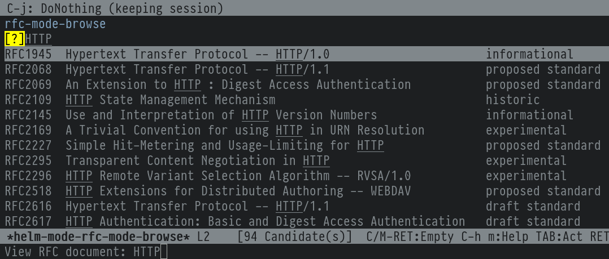
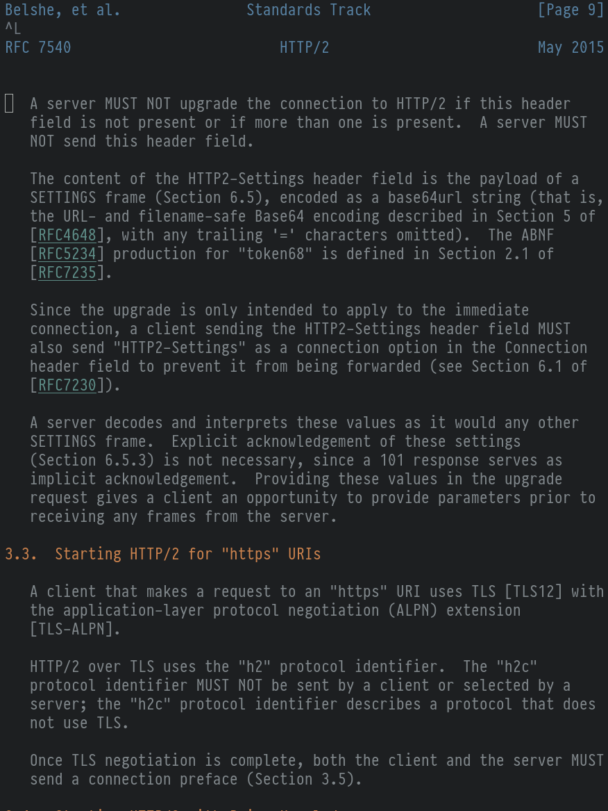

[](https://stable.melpa.org/#/rfc-mode)
[](https://melpa.org/#/rfc-mode)

# rfc-mode

## Introduction

The rfc-mode Emacs major mode is a browser and reader for RFC documents. This
repository holds some possible modifications to the original repository, which
you should compare against. I intend to make a proof-of-concept for adding
compressed-file support to rfc-mode so that it can read my own already-
retrieved compressed files.

This has already been addressed in a previous issue on the original repo, so
I'm checking feasibility.

## Installation

The package should be installed from MELPA. You should only install THIS package
if you need compressed-file support.

Start by loading the mode:

```elisp
(require 'rfc-mode)
```

Then set the location containing all RFC documents (the default value is the
`rfc` directory in the home directory):

```elisp
(setq rfc-mode-directory (expand-file-name "~/rfc/"))
```

RFC documents and their index will be directly downloaded from
https://www.rfc-editor.org when required. Alternatively, the entire RFC
collection can be downloadeded from https://www.rfc-editor.org/retrieve/bulk
to ensure full access without the need for an internet connection.

Call `rfc-mode-browse` to choose a RFC document to read, or `rfc-mode-read` to
enter the reference of the RFC document yourself.

## Screenshots
### Browser


### Reader


## Contact
If you have an idea or a question, email me at <nicolas@n16f.net>.
